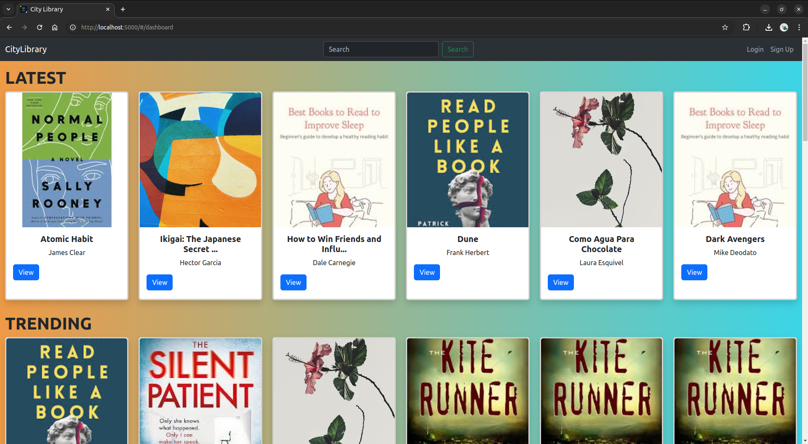

# CityLibrary #

# Website Live at
```
http://65.1.100.5:80
```

# About Project
- This project is about an Online Library Management System.
- There will be one admin and many users.
- Users can sign-up/register and can start reading books or issue e-books.
- Admin can perform CRUD Operations on Section and Books and handle incoming book-requests.


# Project Approach
- Developing a user-friendly and aesthetically pleasing online library website.
- Implement user profiles, including general user profiles and admin specific functionality.

## Screenshots
<div style="width: 100%;display: inline-block">
   
   
   
   
   
   
   
   
</div>


# Technology Stack

The following technologies and tools are used in order to develop this website:

- Flask: For application code, to handle user requests, manage routing, and creating APIs.
- Vue.js: For building a dynamic and responsive user interface.
- Flask-SQLAlchemy: For interaction with the database.
- Flask-Bcrypt: For hashing passwords.
- Bootstrap: For quick CSS styling and aesthetics.
- SQLite: For data storage.
- Redis: For caching.
- Redis and Celery: For batch jobs and task queue management.


### How to run this project  ###

# Create a Virtual Environment

- Firstly Create Virtual Environment.
``` python3 -m venv .env ```

- After creating the .env file invoke the virtual environment.
``` source .env/bin/activate ```


# Start Flask App.

- Install all the dependices needed in order to run this project
- All the required modules are in requirements.txt file
- We will use pip to install
``` pip install -r requirements.txt ```

- After installing all the modules we are ready to run the flask project.
``` python app.py ```
- The web-page will be servered on localhost port 5000.


# Start redis-server at port 6379 to serve cache files.
- Start the Redis server as a background process using the systemctl command.
``` sudo systemctl start redis-server ```

- Make sure it runs in background in order to keep the redis cache work in flask cache.

- To stop the service, use:
``` sudo systemctl stop redis-stack-server ```


# Flask Cache
- 2 mins cache timeout set for User ~ Explore, Category
- 1 mins cache timeout set for Librarian ~ Dashboard


# Celery
- To run celery workers:
- Just Execute the `worker.sh` bash script
* Make sure *Redis Server * is up and running

# Celery-Beat
- To run celery beat:
- Just Execute the `beat.sh` bash script


# Mail Hog
- Use ``` ~/go/bin/MailHog ``` in order to start the smtp server


# Application Structure

```zsh
$ tree
.
├── app.py
├── beat.sh
├── book_report.csv
├── celerybeat-schedule
├── celery_config.py
├── controllers
│   ├── api
│   │   ├── admin.py
│   │   ├── book_api.py
│   │   ├── enrolls.py
│   │   ├── issuebook.py
│   │   ├── profile.py
│   │   ├── __pycache__
│   │   │   ├── admin.cpython-310.pyc
│   │   │   ├── book_api.cpython-310.pyc
│   │   │   ├── enrolls.cpython-310.pyc
│   │   │   ├── index.cpython-310.pyc
│   │   │   ├── issuebook.cpython-310.pyc
│   │   │   ├── profile.cpython-310.pyc
│   │   │   ├── requests.cpython-310.pyc
│   │   │   ├── section_api.cpython-310.pyc
│   │   │   ├── section.cpython-310.pyc
│   │   │   ├── user_api.cpython-310.pyc
│   │   │   └── user.cpython-310.pyc
│   │   ├── requests.py
│   │   ├── section_api.py
│   │   ├── section.py
│   │   └── user.py
│   ├── jobs
│   │   ├── mail.py
│   │   ├── __pycache__
│   │   │   ├── mail.cpython-310.pyc
│   │   │   ├── tasks.cpython-310.pyc
│   │   │   └── workers.cpython-310.pyc
│   │   ├── tasks.py
│   │   └── workers.py
│   ├── __pycache__
│   │   ├── books.cpython-310.pyc
│   │   ├── jot.cpython-310.pyc
│   │   └── rbac.cpython-310.pyc
│   └── rbac.py
├── instance
│   └── books.sqlite3
├── issue_report.csv
├── mad2report.pdf
├── mailhog.sh
├── migrations
│   ├── alembic.ini
│   ├── env.py
│   ├── __pycache__
│   │   └── env.cpython-310.pyc
│   ├── README
│   ├── script.py.mako
│   └── versions
│       ├── 23c8819cf1fc_.py
│       ├── 7a7d10a02bff_.py
│       ├── 9c28125a2896_.py
│       ├── e36e289a5b19_.py
│       └── __pycache__
│           ├── 23c8819cf1fc_.cpython-310.pyc
│           ├── 7a7d10a02bff_.cpython-310.pyc
│           ├── 9c28125a2896_.cpython-310.pyc
│           └── e36e289a5b19_.cpython-310.pyc
├── models
│   ├── model.py
│   └── __pycache__
│       └── model.cpython-310.pyc
├── __pycache__
│   ├── app.cpython-310.pyc
│   └── celery_config.cpython-310.pyc
├── Readme.md
├── requirements.txt
├── static
│   ├── components
│   │   ├── Footer.js
│   │   ├── Navbar.js
│   │   ├── NotFound.js
│   │   └── Policy.js
│   ├── css
│   │   └── global.css
│   ├── img
│   │   ├── admin.png
│   │   ├── book10.jpeg
│   │   ├── book11.jpeg
│   │   ├── book12.jpeg
│   │   ├── book1.jpeg
│   │   ├── book2.jpeg
│   │   ├── book3.jpeg
│   │   ├── book4.jpeg
│   │   ├── book5.jpeg
│   │   ├── book6.jpeg
│   │   ├── book7.jpeg
│   │   ├── book8.jpeg
│   │   ├── book9.jpeg
│   │   ├── D_2NwfYWwAIUE8A.png
│   │   ├── dashboard_chart.png
│   │   ├── global.css
│   │   ├── librarian.jpg
│   │   ├── library-arial-view.jpg
│   │   ├── library.png
│   │   ├── login_img.jpg
│   │   ├── logo_lib.jpeg
│   │   ├── rating.png
│   │   ├── section.png
│   │   └── user.png
│   ├── main.js
│   ├── pages
│   │   ├── admin
│   │   │   ├── AdminDashboard.js
│   │   │   ├── AllBooks.js
│   │   │   ├── AllUsers.js
│   │   │   ├── Enrolls.js
│   │   │   ├── Requests.js
│   │   │   └── Section.js
│   │   ├── Category.js
│   │   ├── Dashboard.js
│   │   ├── Download.js
│   │   ├── Explore.js
│   │   ├── Home.js
│   │   ├── Login.js
│   │   ├── Mybooks.js
│   │   ├── Profile.js
│   │   ├── Search.js
│   │   └── Signup.js
│   ├── router.js
│   ├── store.js
│   └── utils.js
├── templates
│   ├── book_return.html
│   ├── daily_reminder.html
│   ├── index.html
│   └── monthly_report.html
├── user_report.csv
└── worker.sh
```
21 directories, 113 files


# Video
- ```https://drive.google.com/file/d/1PkFru_y1Jb-TIRfNKdrwNj2mbwkmsMNH/view?usp=sharing```

# Project URL
- ```https://drive.google.com/file/d/1h_Oqbixp8FYjuZEjEZo62zrbyVUghZB4/view?usp=sharing```

# Documentation
Ranjeet Sharma (21f2001119)
